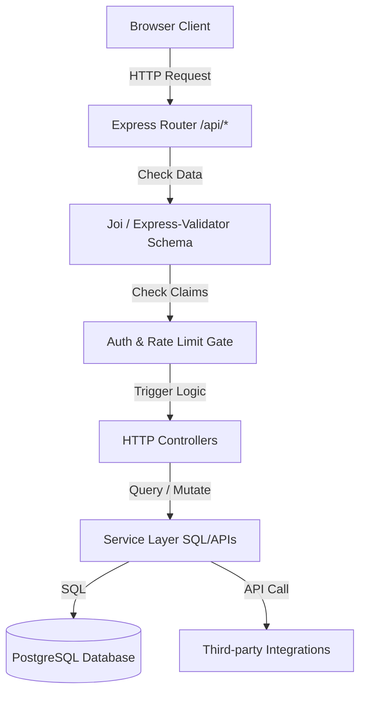

# Backend Architecture Design Spec - AI-OS v2

This document details the software design patterns, architectural layers, and runtime behaviors of the **AI-OS v2** Express framework.

---

## 📡 1. Layered Architecture Flow
AI-OS v2 leverages a decoupled, uni-directional flow separating HTTP controllers from SQL query services and client routes.



### Components:
1. **Routing Layer (`src/routes/`)**: Maps network paths to controller handlers.
2. **Validator Layer (`src/validators/`)**: Rejects malformed requests before execution.
3. **Middleware Layer (`src/middleware/`)**: Performs token authentications, rate limiting, and administrative gates.
4. **Controller Layer (`src/controllers/`)**: Manages HTTP responses, status codes, and translates errors.
5. **Service Layer (`src/services/`)**: Executes database transactional blocks, SMTP email queues, and third-party APIs.

---

## 🛡️ 2. Request Validation Pipeline
- Input validation occurs prior to controller access using schema sanitization rules.
- Any mismatch instantly triggers a `400 Bad Request` payload containing fields mapping error descriptions:
  ```json
  {
    "error": "Validation failed",
    "details": [
      { "field": "email", "message": "Email address format is invalid" }
    ]
  }
  ```

---

## 🚨 3. Global Exception & Error Interception
All controllers must forward errors using Express `next(err)`. A centralized error-intercepting middleware captures uncaught rejections:
```javascript
app.use((err, req, res, next) => {
  const statusCode = err.status || 500;
  console.error(`[Error Handler] ${req.method} ${req.url} - Status ${statusCode}:`, err);
  
  res.status(statusCode).json({
    error: err.message || 'Internal Server Error'
  });
});
```

---

## ⏳ 4. Process Lifecycle & Graceful Shutdown
To prevent corrupted database writes and dropped user connections during deployments, the server listens for process signals (`SIGTERM`, `SIGINT`) and closes sockets before terminating:
```javascript
const server = app.listen(PORT);

process.on('SIGTERM', () => {
  console.log('SIGTERM received. Closing HTTP server...');
  server.close(() => {
    console.log('HTTP server closed. Disconnecting database pools...');
    // database.disconnect().then(() => process.exit(0));
  });
});
```
