# PostgreSQL Database Architecture Spec - AI-OS v2

This document details the normalized relational database architecture designed for **AI-OS v2**.

---

## 📊 Entity Relationship (ER) Diagram

```mermaid
erDiagram
    USERS ||--|| PROFILES : has
    USERS ||--o{ SESSIONS : establishes
    USERS ||--o{ EMAIL_VERIFICATIONS : requests
    USERS ||--o{ PASSWORD_RESETS : requests
    USERS ||--|| SUBSCRIPTIONS : owns
    USERS ||--o{ PAYMENTS : initiates
    USERS ||--o{ TRANSACTIONS : ledger
    USERS ||--|| TRIALS : active_period
    USERS ||--|| PROMPT_USAGES : records
    USERS ||--o{ AI_HISTORY : consults
    USERS ||--o{ NOTIFICATIONS : receives
    USERS ||--o{ SUPPORT_TICKETS : creates
    USERS ||--|| USER_PREFERENCES : configures
    USERS ||--o{ VIDEO_PROGRESS : watches
    USERS ||--o{ BUSINESS_PROGRESS : achieves
    USERS ||--o{ BOOKMARKS : saves
    USERS ||--o{ ADMIN_LOGS : executes

    USERS {
        uuid id PK
        varchar email UK
        varchar password_hash
        user_role role
        boolean is_verified
        timestamp created_at
        timestamp updated_at
    }

    PROFILES {
        uuid id PK
        uuid user_id FK
        varchar name
        date date_of_birth
        user_gender gender
        varchar profession
        timestamp created_at
        timestamp updated_at
    }

    SESSIONS {
        uuid id PK
        uuid user_id FK
        varchar session_token UK
        varchar ip_address
        varchar user_agent
        timestamp expires_at
        timestamp created_at
    }

    EMAIL_VERIFICATIONS {
        uuid id PK
        uuid user_id FK
        varchar code
        boolean is_used
        timestamp expires_at
        timestamp created_at
    }

    PASSWORD_RESETS {
        uuid id PK
        uuid user_id FK
        varchar reset_token UK
        boolean is_used
        timestamp expires_at
        timestamp created_at
    }

    SUBSCRIPTIONS {
        uuid id PK
        uuid user_id FK
        plan_type plan
        subscription_status status
        timestamp current_period_start
        timestamp current_period_end
        timestamp created_at
        timestamp updated_at
    }

    PAYMENTS {
        uuid id PK
        uuid user_id FK
        uuid subscription_id FK
        payment_provider provider
        numeric amount
        varchar currency
        varchar gateway_order_id UK
        varchar gateway_payment_id UK
        varchar gateway_signature
        payment_status status
        timestamp created_at
        timestamp updated_at
    }

    TRANSACTIONS {
        uuid id PK
        uuid user_id FK
        uuid payment_id FK
        numeric amount
        transaction_type type
        text description
        timestamp created_at
    }

    TRIALS {
        uuid id PK
        uuid user_id FK
        timestamp started_at
        timestamp expires_at
        integer days_remaining
        timestamp created_at
    }

    PROMPT_USAGES {
        uuid id PK
        uuid user_id FK
        integer prompt_count
        timestamp limit_reached_at
        timestamp reset_at
        timestamp created_at
    }

    AI_HISTORY {
        uuid id PK
        uuid user_id FK
        ai_action_type action
        jsonb input_data
        jsonb output_data
        timestamp created_at
    }

    NOTIFICATIONS {
        uuid id PK
        uuid user_id FK
        varchar title
        text message
        notification_type type
        boolean is_read
        timestamp created_at
    }

    SUPPORT_TICKETS {
        uuid id PK
        uuid user_id FK
        varchar subject
        text message
        ticket_status status
        ticket_priority priority
        timestamp created_at
        timestamp updated_at
    }

    USER_PREFERENCES {
        uuid id PK
        uuid user_id FK
        theme_mode theme
        language_mode language
        timestamp created_at
        timestamp updated_at
    }

    VIDEO_PROGRESS {
        uuid id PK
        uuid user_id FK
        varchar video_filename
        numeric progress_seconds
        boolean is_completed
        timestamp created_at
        timestamp updated_at
    }

    BUSINESS_PROGRESS {
        uuid id PK
        uuid user_id FK
        varchar step_key
        boolean is_unlocked
        integer progress_percentage
        timestamp created_at
        timestamp updated_at
    }

    BOOKMARKS {
        uuid id PK
        uuid user_id FK
        varchar tool_id
        timestamp created_at
    }

    ADMIN_LOGS {
        uuid id PK
        uuid user_id FK
        varchar action_name
        jsonb details
        varchar ip_address
        timestamp created_at
    }
```



---

## 🗃️ DDL Specifications & Schema Schema

### Enums
```sql
CREATE TYPE user_role AS ENUM ('Admin', 'User', 'Support');
CREATE TYPE user_gender AS ENUM ('Male', 'Female', 'Other', 'Prefer_Not_To_Say');
CREATE TYPE plan_type AS ENUM ('Free', 'Premium', 'Trial');
CREATE TYPE subscription_status AS ENUM ('Active', 'Canceled', 'Past_Due', 'Expired');
CREATE TYPE payment_provider AS ENUM ('Razorpay');
CREATE TYPE payment_status AS ENUM ('Pending', 'Completed', 'Failed');
CREATE TYPE transaction_type AS ENUM ('Credit', 'Charge');
CREATE TYPE ai_action_type AS ENUM ('Compile', 'Chat');
CREATE TYPE notification_type AS ENUM ('System', 'Update', 'Billing');
CREATE TYPE ticket_status AS ENUM ('Open', 'In_Progress', 'Closed');
CREATE TYPE ticket_priority AS ENUM ('Low', 'Medium', 'High');
CREATE TYPE theme_mode AS ENUM ('Dark', 'Light');
CREATE TYPE language_mode AS ENUM ('English', 'Hindi', 'Hinglish');
```

### Tables

#### 1. Users
```sql
CREATE TABLE users (
    id UUID PRIMARY KEY DEFAULT gen_random_uuid(),
    email VARCHAR(255) UNIQUE NOT NULL,
    password_hash VARCHAR(255) NOT NULL,
    role user_role NOT NULL DEFAULT 'User',
    is_verified BOOLEAN NOT NULL DEFAULT FALSE,
    created_at TIMESTAMP WITH TIME ZONE DEFAULT CURRENT_TIMESTAMP,
    updated_at TIMESTAMP WITH TIME ZONE DEFAULT CURRENT_TIMESTAMP
);
CREATE INDEX idx_users_email ON users(email);
```

#### 2. Profiles
```sql
CREATE TABLE profiles (
    id UUID PRIMARY KEY DEFAULT gen_random_uuid(),
    user_id UUID UNIQUE NOT NULL REFERENCES users(id) ON DELETE CASCADE,
    name VARCHAR(255) NOT NULL,
    date_of_birth DATE NOT NULL,
    gender user_gender NOT NULL DEFAULT 'Prefer_Not_To_Say',
    profession VARCHAR(255) NOT NULL,
    created_at TIMESTAMP WITH TIME ZONE DEFAULT CURRENT_TIMESTAMP,
    updated_at TIMESTAMP WITH TIME ZONE DEFAULT CURRENT_TIMESTAMP
);
```

#### 3. Sessions
```sql
CREATE TABLE sessions (
    id UUID PRIMARY KEY DEFAULT gen_random_uuid(),
    user_id UUID NOT NULL REFERENCES users(id) ON DELETE CASCADE,
    session_token VARCHAR(512) UNIQUE NOT NULL,
    ip_address VARCHAR(45),
    user_agent VARCHAR(512),
    expires_at TIMESTAMP WITH TIME ZONE NOT NULL,
    created_at TIMESTAMP WITH TIME ZONE DEFAULT CURRENT_TIMESTAMP
);
CREATE INDEX idx_sessions_token ON sessions(session_token);
CREATE INDEX idx_sessions_user_id ON sessions(user_id);
```

#### 4. EmailVerification
```sql
CREATE TABLE email_verifications (
    id UUID PRIMARY KEY DEFAULT gen_random_uuid(),
    user_id UUID NOT NULL REFERENCES users(id) ON DELETE CASCADE,
    code VARCHAR(6) NOT NULL,
    is_used BOOLEAN NOT NULL DEFAULT FALSE,
    expires_at TIMESTAMP WITH TIME ZONE NOT NULL,
    created_at TIMESTAMP WITH TIME ZONE DEFAULT CURRENT_TIMESTAMP
);
CREATE INDEX idx_email_verifications_user_code ON email_verifications(user_id, code);
```

#### 5. PasswordReset
```sql
CREATE TABLE password_resets (
    id UUID PRIMARY KEY DEFAULT gen_random_uuid(),
    user_id UUID NOT NULL REFERENCES users(id) ON DELETE CASCADE,
    reset_token VARCHAR(255) UNIQUE NOT NULL,
    is_used BOOLEAN NOT NULL DEFAULT FALSE,
    expires_at TIMESTAMP WITH TIME ZONE NOT NULL,
    created_at TIMESTAMP WITH TIME ZONE DEFAULT CURRENT_TIMESTAMP
);
CREATE INDEX idx_password_resets_token ON password_resets(reset_token);
```

#### 6. Subscriptions
```sql
CREATE TABLE subscriptions (
    id UUID PRIMARY KEY DEFAULT gen_random_uuid(),
    user_id UUID UNIQUE NOT NULL REFERENCES users(id) ON DELETE CASCADE,
    plan plan_type NOT NULL DEFAULT 'Free',
    status subscription_status NOT NULL DEFAULT 'Expired',
    current_period_start TIMESTAMP WITH TIME ZONE NOT NULL,
    current_period_end TIMESTAMP WITH TIME ZONE NOT NULL,
    created_at TIMESTAMP WITH TIME ZONE DEFAULT CURRENT_TIMESTAMP,
    updated_at TIMESTAMP WITH TIME ZONE DEFAULT CURRENT_TIMESTAMP,
    CONSTRAINT check_subscription_period CHECK (current_period_end > current_period_start)
);
CREATE INDEX idx_subscriptions_user_status ON subscriptions(user_id, status);
```

#### 7. Payments
```sql
CREATE TABLE payments (
    id UUID PRIMARY KEY DEFAULT gen_random_uuid(),
    user_id UUID NOT NULL REFERENCES users(id) ON DELETE CASCADE,
    subscription_id UUID NOT NULL REFERENCES subscriptions(id) ON DELETE RESTRICT,
    provider payment_provider NOT NULL DEFAULT 'Razorpay',
    amount NUMERIC(12, 2) NOT NULL,
    currency VARCHAR(3) NOT NULL DEFAULT 'INR',
    gateway_order_id VARCHAR(255) UNIQUE NOT NULL,
    gateway_payment_id VARCHAR(255) UNIQUE,
    gateway_signature VARCHAR(255),
    status payment_status NOT NULL DEFAULT 'Pending',
    created_at TIMESTAMP WITH TIME ZONE DEFAULT CURRENT_TIMESTAMP,
    updated_at TIMESTAMP WITH TIME ZONE DEFAULT CURRENT_TIMESTAMP,
    CONSTRAINT check_positive_amount CHECK (amount > 0)
);
CREATE INDEX idx_payments_order ON payments(gateway_order_id);
```

#### 8. Transactions
```sql
CREATE TABLE transactions (
    id UUID PRIMARY KEY DEFAULT gen_random_uuid(),
    user_id UUID NOT NULL REFERENCES users(id) ON DELETE CASCADE,
    payment_id UUID REFERENCES payments(id) ON DELETE SET NULL,
    amount NUMERIC(12, 2) NOT NULL,
    type transaction_type NOT NULL,
    description TEXT NOT NULL,
    created_at TIMESTAMP WITH TIME ZONE DEFAULT CURRENT_TIMESTAMP
);
CREATE INDEX idx_transactions_user ON transactions(user_id);
```

#### 9. Trials
```sql
CREATE TABLE trials (
    id UUID PRIMARY KEY DEFAULT gen_random_uuid(),
    user_id UUID UNIQUE NOT NULL REFERENCES users(id) ON DELETE CASCADE,
    started_at TIMESTAMP WITH TIME ZONE NOT NULL,
    expires_at TIMESTAMP WITH TIME ZONE NOT NULL,
    days_remaining INTEGER NOT NULL DEFAULT 3,
    created_at TIMESTAMP WITH TIME ZONE DEFAULT CURRENT_TIMESTAMP,
    CONSTRAINT check_trial_period CHECK (expires_at > started_at)
);
```

#### 10. PromptUsage
```sql
CREATE TABLE prompt_usages (
    id UUID PRIMARY KEY DEFAULT gen_random_uuid(),
    user_id UUID UNIQUE NOT NULL REFERENCES users(id) ON DELETE CASCADE,
    prompt_count INTEGER NOT NULL DEFAULT 0,
    limit_reached_at TIMESTAMP WITH TIME ZONE,
    reset_at TIMESTAMP WITH TIME ZONE NOT NULL,
    created_at TIMESTAMP WITH TIME ZONE DEFAULT CURRENT_TIMESTAMP,
    CONSTRAINT check_count_positive CHECK (prompt_count >= 0)
);
```

#### 11. AIHistory
```sql
CREATE TABLE ai_history (
    id UUID PRIMARY KEY DEFAULT gen_random_uuid(),
    user_id UUID NOT NULL REFERENCES users(id) ON DELETE CASCADE,
    action ai_action_type NOT NULL,
    input_data JSONB NOT NULL,
    output_data JSONB NOT NULL,
    created_at TIMESTAMP WITH TIME ZONE DEFAULT CURRENT_TIMESTAMP
);
CREATE INDEX idx_ai_history_user ON ai_history(user_id);
CREATE INDEX idx_ai_history_data ON ai_history USING GIN (input_data, output_data);
```

#### 12. Notifications
```sql
CREATE TABLE notifications (
    id UUID PRIMARY KEY DEFAULT gen_random_uuid(),
    user_id UUID NOT NULL REFERENCES users(id) ON DELETE CASCADE,
    title VARCHAR(255) NOT NULL,
    message TEXT NOT NULL,
    type notification_type NOT NULL DEFAULT 'System',
    is_read BOOLEAN NOT NULL DEFAULT FALSE,
    created_at TIMESTAMP WITH TIME ZONE DEFAULT CURRENT_TIMESTAMP
);
CREATE INDEX idx_notifications_user_unread ON notifications(user_id) WHERE is_read = FALSE;
```

#### 13. SupportTickets
```sql
CREATE TABLE support_tickets (
    id UUID PRIMARY KEY DEFAULT gen_random_uuid(),
    user_id UUID NOT NULL REFERENCES users(id) ON DELETE CASCADE,
    subject VARCHAR(255) NOT NULL,
    message TEXT NOT NULL,
    status ticket_status NOT NULL DEFAULT 'Open',
    priority ticket_priority NOT NULL DEFAULT 'Medium',
    created_at TIMESTAMP WITH TIME ZONE DEFAULT CURRENT_TIMESTAMP,
    updated_at TIMESTAMP WITH TIME ZONE DEFAULT CURRENT_TIMESTAMP
);
CREATE INDEX idx_support_tickets_user ON support_tickets(user_id);
```

#### 14. UserPreferences
```sql
CREATE TABLE user_preferences (
    id UUID PRIMARY KEY DEFAULT gen_random_uuid(),
    user_id UUID UNIQUE NOT NULL REFERENCES users(id) ON DELETE CASCADE,
    theme theme_mode NOT NULL DEFAULT 'Dark',
    language language_mode NOT NULL DEFAULT 'English',
    created_at TIMESTAMP WITH TIME ZONE DEFAULT CURRENT_TIMESTAMP,
    updated_at TIMESTAMP WITH TIME ZONE DEFAULT CURRENT_TIMESTAMP
);
```

#### 15. VideoProgress
```sql
CREATE TABLE video_progress (
    id UUID PRIMARY KEY DEFAULT gen_random_uuid(),
    user_id UUID NOT NULL REFERENCES users(id) ON DELETE CASCADE,
    video_filename VARCHAR(255) NOT NULL,
    progress_seconds NUMERIC(10, 2) NOT NULL DEFAULT 0.00,
    is_completed BOOLEAN NOT NULL DEFAULT FALSE,
    created_at TIMESTAMP WITH TIME ZONE DEFAULT CURRENT_TIMESTAMP,
    updated_at TIMESTAMP WITH TIME ZONE DEFAULT CURRENT_TIMESTAMP,
    UNIQUE(user_id, video_filename),
    CONSTRAINT check_progress_non_negative CHECK (progress_seconds >= 0.00)
);
CREATE INDEX idx_video_progress_user ON video_progress(user_id);
```

#### 16. BusinessProgress
```sql
CREATE TABLE business_progress (
    id UUID PRIMARY KEY DEFAULT gen_random_uuid(),
    user_id UUID NOT NULL REFERENCES users(id) ON DELETE CASCADE,
    step_key VARCHAR(255) NOT NULL,
    is_unlocked BOOLEAN NOT NULL DEFAULT FALSE,
    progress_percentage INTEGER NOT NULL DEFAULT 0,
    created_at TIMESTAMP WITH TIME ZONE DEFAULT CURRENT_TIMESTAMP,
    updated_at TIMESTAMP WITH TIME ZONE DEFAULT CURRENT_TIMESTAMP,
    UNIQUE(user_id, step_key),
    CONSTRAINT check_percentage_range CHECK (progress_percentage >= 0 AND progress_percentage <= 100)
);
```

#### 17. Bookmarks
```sql
CREATE TABLE bookmarks (
    id UUID PRIMARY KEY DEFAULT gen_random_uuid(),
    user_id UUID NOT NULL REFERENCES users(id) ON DELETE CASCADE,
    tool_id VARCHAR(255) NOT NULL,
    created_at TIMESTAMP WITH TIME ZONE DEFAULT CURRENT_TIMESTAMP,
    UNIQUE(user_id, tool_id)
);
CREATE INDEX idx_bookmarks_user ON bookmarks(user_id);
```

#### 18. AdminLogs
```sql
CREATE TABLE admin_logs (
    id UUID PRIMARY KEY DEFAULT gen_random_uuid(),
    user_id UUID REFERENCES users(id) ON DELETE SET NULL,
    action_name VARCHAR(255) NOT NULL,
    details JSONB NOT NULL,
    ip_address VARCHAR(45),
    created_at TIMESTAMP WITH TIME ZONE DEFAULT CURRENT_TIMESTAMP
);
CREATE INDEX idx_admin_logs_action ON admin_logs(action_name);
CREATE INDEX idx_admin_logs_details ON admin_logs USING GIN (details);
```

---

## 📈 Optimization & Database Guidelines
1. **Cascade Triggers**: Table updates (`updated_at`) must trigger refresh functions automatically.
2. **Cascading Deletions**: User deletion completely cascades down to their Profile, Sessions, Preferences, Bookmarks, and VideoProgress logs.
3. **Restricted Deletions**: Subscriptions with active Payment records are restricted from hard deletion.
4. **JSONB Data Types**: AI history prompts, responses, and admin logs use `jsonb` instead of text, supported by GIN index mapping.
5. **Partial Indexing**: Partial indexing on Notifications `is_read = FALSE` allows rapid fetching of unread user updates.
